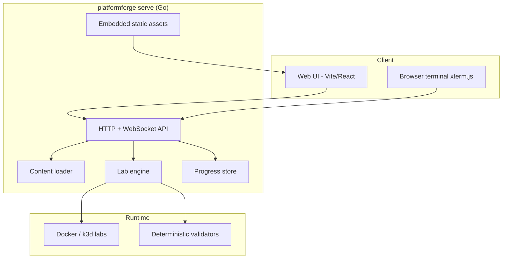

# PlatformForge

PlatformForge is a local-first platform-engineering school with concise lessons, isolated Docker labs, a browser terminal, deterministic validation, reset/retry, and local progress tracking.

## Architecture



| Component | Path | Role |
| --- | --- | --- |
| CLI / server | `cmd/platformforge` | Doctor, serve, lab lifecycle commands |
| Lab engine | `internal/lab` | Start/stop/validate/reset isolated lab containers |
| API layer | `internal/api` | REST + WebSocket endpoints for UI and terminal |
| Content packs | `content/` | Course manifests, lessons, lab definitions |
| Web frontend | `web/` | Lesson browser, lab status, embedded terminal |
| Progress | `internal/progress` | Local completion state (no cloud dependency) |

Labs run with dropped Linux capabilities, `no-new-privileges`, CPU/memory/PID limits, restricted temp storage, and **no host Docker socket mount**.

## Quick start on Ubuntu WSL2

```bash
git clone https://github.com/cozyGarage/platformforge.git ~/Projects/platformforge
cd ~/Projects/platformforge
./scripts/bootstrap-ubuntu.sh
./bin/platformforge serve
```

Open http://127.0.0.1:8080.

## CLI

```bash
platformforge doctor
platformforge serve
platformforge lab start linux-navigation
platformforge lab validate linux-navigation
platformforge lab reset linux-navigation
platformforge lab stop linux-navigation
```

Check whether a lab is already running:

```bash
curl http://127.0.0.1:8080/api/labs/linux-navigation/status
```

The server binds to loopback by default. Review third-party course packs before running them.

The original `platform-foundations` course includes five guided labs and an incident capstone spanning Linux, Git, containers, networking, Kubernetes, and incident response.

## Development

Run `make test`, `make lint`, `make smoke`, and `make e2e` (Playwright; install browser deps first). See [development setup](docs/development.md) and [lab authoring](docs/authoring.md).

Platform code is Apache-2.0. Adapted 90DaysOfDevOps content belongs in `content/90days` under CC BY-NC-SA 4.0 with attribution.
