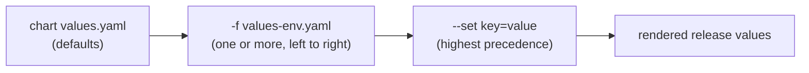

**Helm** is Kubernetes' package manager. Charts bundle manifests, templates, and default values into versioned artifacts that can be installed, upgraded, rolled back, and distributed through registries. Helm transforms raw YAML management into a reproducible, environment-aware software delivery process.

**Learning objectives**
- Model Helm chart structure: Chart.yaml, values.yaml, templates
- Implement deep-merge value override resolution
- Simulate the release lifecycle: install, upgrade, rollback
- Model Helm hooks for pre-install and pre-upgrade jobs

## Core Concepts

| Concept | Definition | Key Detail |
|---|---|---|
| Chart | Packaged application with templates + defaults | Versioned artifact in OCI registry |
| Release | A chart installed in a cluster with a name | Multiple releases of same chart possible |
| Values | Configuration parameters for templates | Layered override: defaults → file → --set |
| Template | Go template that renders to K8s manifests | `{{ .Values.image.tag }}` |
| `_helpers.tpl` | Named template partials (DRY) | `{{ include "mychart.labels" . }}` |
| Dependencies | Sub-charts (postgresql, redis) | Listed in Chart.yaml, fetched by `helm dep up` |
| Hook | Job/Pod at lifecycle point | pre-install, post-upgrade, pre-rollback |
| `helm upgrade --install` | Install if missing, upgrade if present | CI/CD idempotent command |
| `helm rollback` | Restore previous release revision | Kubernetes reverts manifests |
| Chart.lock | Pinned dependency versions | Like package-lock.json |



Each layer wins over everything to its left, which is why a `--set` on the command line always beats a values file committed to Git.

```python
from dataclasses import dataclass, field
from typing import Dict, Any, List, Optional
import json
import copy

# ---------------------------------------------------------------------------
# Chart and Values data model
# ---------------------------------------------------------------------------

@dataclass
class ChartDependency:
    name: str
    version: str
    repository: str
    condition: Optional[str] = None  # e.g. 'postgresql.enabled'

    def to_dict(self) -> dict:
        d = {'name': self.name, 'version': self.version, 'repository': self.repository}
        if self.condition:
            d['condition'] = self.condition
        return d


@dataclass
class ChartMetadata:
    name: str
    version: str          # Chart version (semver)
    app_version: str      # Application version
    description: str
    api_version: str = 'v2'
    keywords: List[str] = field(default_factory=list)
    dependencies: List[ChartDependency] = field(default_factory=list)

    def to_dict(self) -> dict:
        d = {
            'apiVersion':   self.api_version,
            'name':         self.name,
            'version':      self.version,
            'appVersion':   self.app_version,
            'description':  self.description,
        }
        if self.keywords:
            d['keywords'] = self.keywords
        if self.dependencies:
            d['dependencies'] = [dep.to_dict() for dep in self.dependencies]
        return d


def deep_merge(base: Dict[str, Any], overrides: Dict[str, Any]) -> Dict[str, Any]:
    """Deep-merge overrides into base (non-mutating)."""
    result = copy.deepcopy(base)
    for key, val in overrides.items():
        if isinstance(val, dict) and isinstance(result.get(key), dict):
            result[key] = deep_merge(result[key], val)
        else:
            result[key] = copy.deepcopy(val)
    return result


@dataclass
class HelmValues:
    defaults: Dict[str, Any]

    def resolve(self, *overrides_chain: Dict[str, Any]) -> Dict[str, Any]:
        """
        Merge override layers left-to-right (each layer wins over previous).
        Mimics: defaults → -f values-env.yaml → --set key=value
        """
        result = copy.deepcopy(self.defaults)
        for overrides in overrides_chain:
            result = deep_merge(result, overrides)
        return result


# ---------------------------------------------------------------------------
# Define an ML inference API chart
# ---------------------------------------------------------------------------
chart = ChartMetadata(
    name='ml-inference-api',
    version='2.3.0',
    app_version='1.4.2',
    description='Production ML inference API with autoscaling and observability',
    keywords=['ml', 'inference', 'api', 'gpu'],
    dependencies=[
        ChartDependency('postgresql', '>=14.0.0', 'https://charts.bitnami.com/bitnami',
                        condition='postgresql.enabled'),
        ChartDependency('redis',      '>=18.0.0', 'https://charts.bitnami.com/bitnami',
                        condition='redis.enabled'),
    ],
)

values = HelmValues({
    'replicaCount': 2,
    'image': {
        'repository': 'ghcr.io/org/ml-inference-api',
        'tag': 'latest',
        'pullPolicy': 'IfNotPresent',
    },
    'service': {'type': 'ClusterIP', 'port': 80},
    'resources': {
        'requests': {'cpu': '200m', 'memory': '512Mi'},
        'limits':   {'cpu': '2000m', 'memory': '2Gi'},
    },
    'autoscaling': {
        'enabled': True, 'minReplicas': 2, 'maxReplicas': 10,
        'targetCPUUtilizationPercentage': 70,
    },
    'postgresql': {'enabled': False},
    'redis':      {'enabled': True, 'auth': {'enabled': True}},
    'ingress': {'enabled': False},
    'monitoring': {'serviceMonitor': {'enabled': True}},
})

print('Chart.yaml:')
print(json.dumps(chart.to_dict(), indent=2))

print('\nDefault values.yaml (excerpt):')
print(json.dumps(values.defaults, indent=2))
```

## Value Override Resolution and Release Lifecycle

```python
import time
from dataclasses import dataclass, field
from typing import Dict, Any, List, Optional
from enum import Enum

class ReleaseStatus(Enum):
    DEPLOYED   = 'deployed'
    SUPERSEDED = 'superseded'
    FAILED     = 'failed'
    PENDING    = 'pending-install'


@dataclass
class ReleaseRevision:
    revision: int
    chart_version: str
    values: Dict[str, Any]
    status: ReleaseStatus
    description: str
    timestamp: float = field(default_factory=time.time)


@dataclass
class HelmRelease:
    release_name: str
    namespace: str
    chart: ChartMetadata
    base_values: HelmValues
    _history: List[ReleaseRevision] = field(default_factory=list)

    @property
    def current_revision(self) -> Optional[ReleaseRevision]:
        deployed = [r for r in self._history if r.status == ReleaseStatus.DEPLOYED]
        return deployed[-1] if deployed else None

    def install(self, values_file: Dict = None, set_values: Dict = None,
                description: str = 'Initial install') -> ReleaseRevision:
        merged = self.base_values.resolve(values_file or {}, set_values or {})
        rev = ReleaseRevision(
            revision=1,
            chart_version=self.chart.version,
            values=merged,
            status=ReleaseStatus.DEPLOYED,
            description=description,
        )
        self._history.append(rev)
        return rev

    def upgrade(self, new_chart: ChartMetadata = None, values_file: Dict = None,
                set_values: Dict = None, description: str = 'Upgrade') -> ReleaseRevision:
        if not self._history:
            raise ValueError('No existing release to upgrade. Use install first.')
        # Supersede current
        for r in self._history:
            if r.status == ReleaseStatus.DEPLOYED:
                r.status = ReleaseStatus.SUPERSEDED
        chart = new_chart or self.chart
        merged = self.base_values.resolve(values_file or {}, set_values or {})
        rev = ReleaseRevision(
            revision=len(self._history) + 1,
            chart_version=chart.version,
            values=merged,
            status=ReleaseStatus.DEPLOYED,
            description=description,
        )
        self._history.append(rev)
        return rev

    def rollback(self, target_revision: int) -> ReleaseRevision:
        target = next((r for r in self._history if r.revision == target_revision), None)
        if not target:
            raise ValueError(f'Revision {target_revision} not found')
        # Supersede current
        for r in self._history:
            if r.status == ReleaseStatus.DEPLOYED:
                r.status = ReleaseStatus.SUPERSEDED
        # Create new revision that is a copy of the target
        rollback_rev = ReleaseRevision(
            revision=len(self._history) + 1,
            chart_version=target.chart_version,
            values=target.values,
            status=ReleaseStatus.DEPLOYED,
            description=f'Rollback to revision {target_revision}',
        )
        self._history.append(rollback_rev)
        return rollback_rev

    def history(self) -> None:
        print(f'REVISION  STATUS       CHART VERSION   DESCRIPTION')
        print('-' * 65)
        for r in self._history:
            print(f'  {r.revision:<8} {r.status.value:<12} {r.chart_version:<15} {r.description}')


# Simulate a deployment lifecycle
release = HelmRelease('ml-inference-api', 'production', chart, values)

# Environment-specific value overrides (simulating values-prod.yaml)
prod_values_file = {
    'replicaCount': 5,
    'image': {'tag': 'v1.4.0'},
    'autoscaling': {'maxReplicas': 20},
    'ingress': {'enabled': True, 'host': 'api.example.com'},
}

r1 = release.install(values_file=prod_values_file, description='Initial production deploy')
print(f'Installed: revision={r1.revision} replicas={r1.values["replicaCount"]} '
      f'tag={r1.values["image"]["tag"]}')

# Upgrade: new image tag via --set
r2 = release.upgrade(
    values_file=prod_values_file,
    set_values={'image': {'tag': 'v1.5.0'}, 'replicaCount': 6},
    description='Upgrade to v1.5.0',
)
print(f'Upgraded:  revision={r2.revision} replicas={r2.values["replicaCount"]} '
      f'tag={r2.values["image"]["tag"]}')

# Upgrade with a bug — simulate failed revision
r3 = release.upgrade(
    values_file=prod_values_file,
    set_values={'image': {'tag': 'v1.6.0-broken'}},
    description='Upgrade to v1.6.0 (broken)',
)
r3.status = ReleaseStatus.FAILED
# Mark current as failed, supersede to previous deployed
print(f'v1.6.0 failed! Rolling back...')

# Rollback to revision 2
r4 = release.rollback(target_revision=2)
print(f'Rollback:  revision={r4.revision} replicas={r4.values["replicaCount"]} '
      f'tag={r4.values["image"]["tag"]}')

print()
print('Release history:')
release.history()
```

## Helm Hooks — Lifecycle Job Simulation

```python
from dataclasses import dataclass, field
from typing import List, Optional, Callable
from enum import Enum

class HookEvent(Enum):
    PRE_INSTALL     = 'pre-install'
    POST_INSTALL    = 'post-install'
    PRE_UPGRADE     = 'pre-upgrade'
    POST_UPGRADE    = 'post-upgrade'
    PRE_ROLLBACK    = 'pre-rollback'
    POST_ROLLBACK   = 'post-rollback'
    PRE_DELETE      = 'pre-delete'


@dataclass
class HelmHook:
    name: str
    event: HookEvent
    weight: int = 0           # lower weight runs first
    delete_policy: str = 'before-hook-creation'  # or 'hook-succeeded'
    job: Callable[[], bool] = field(default=lambda: True)  # returns True if succeeded


@dataclass
class HelmLifecycle:
    hooks: List[HelmHook] = field(default_factory=list)

    def run_hooks(self, event: HookEvent) -> bool:
        relevant = sorted(
            [h for h in self.hooks if h.event == event],
            key=lambda h: h.weight,
        )
        if not relevant:
            return True
        print(f'  Running {event.value} hooks:')
        for hook in relevant:
            success = hook.job()
            status = 'succeeded' if success else 'FAILED'
            print(f'    [{status:9}] {hook.name} (weight={hook.weight})')
            if not success:
                print(f'    Hook {hook.name} failed — aborting lifecycle!')
                return False
        return True

    def upgrade_with_hooks(self, release_name: str, migrate_fn: Callable, fail_db: bool = False) -> None:
        print(f'helm upgrade {release_name}')
        if not self.run_hooks(HookEvent.PRE_UPGRADE):
            print('  Upgrade aborted due to pre-upgrade hook failure')
            return
        print('  Applying manifests... (simulated)')
        print('  Waiting for rollout...')
        if not self.run_hooks(HookEvent.POST_UPGRADE):
            print('  post-upgrade hook failed (rollback recommended)')
            return
        print('  Upgrade complete.')


# Simulate hooks for a DB-backed service upgrade
import random

lifecycle = HelmLifecycle(hooks=[
    HelmHook(
        name='db-schema-migrate',
        event=HookEvent.PRE_UPGRADE,
        weight=10,
        job=lambda: (print('      Running: alembic upgrade head'), True)[1],
    ),
    HelmHook(
        name='seed-config-data',
        event=HookEvent.PRE_UPGRADE,
        weight=20,
        job=lambda: (print('      Running: seed config table'), True)[1],
    ),
    HelmHook(
        name='smoke-test',
        event=HookEvent.POST_UPGRADE,
        weight=0,
        job=lambda: (print('      Running: smoke test GET /health'), True)[1],
    ),
    HelmHook(
        name='notify-slack',
        event=HookEvent.POST_UPGRADE,
        weight=10,
        job=lambda: (print('      Sending: deployment notification to #deploys'), True)[1],
    ),
])

print('=== Successful upgrade with hooks ===')
lifecycle.upgrade_with_hooks('ml-inference-api', migrate_fn=lambda: True)

print()
print('=== Upgrade with failing pre-upgrade hook ===')
failing_lifecycle = HelmLifecycle(hooks=[
    HelmHook(
        name='db-schema-migrate-v2',
        event=HookEvent.PRE_UPGRADE,
        weight=10,
        job=lambda: (print('      Running: migration... COLUMN not found!'), False)[1],
    ),
])
failing_lifecycle.upgrade_with_hooks('ml-inference-api', migrate_fn=lambda: False)
```

## Quick Quiz

**Q1**: What is the Helm values override precedence order?
> **A**: From lowest to highest precedence: (1) chart defaults `values.yaml`, (2) parent chart's `values.yaml` for sub-charts, (3) `-f values-override.yaml` files (left to right), (4) `--set key=value` flags. Each layer wins over all previous layers.

**Q2**: What does `helm rollback` actually do in the cluster?
> **A**: Helm re-applies the manifests from the target revision (re-running `kubectl apply` with the old templates and values). It creates a new revision in the history — it does NOT revert history. The cluster state is replaced by the old manifests, but revision 3 still shows as "superseded" in history.

**Q3**: Why should secrets never be stored in Helm values files?
> **A**: Values files are typically committed to Git, and Helm stores release state in Kubernetes secrets (base64, not encrypted). Both are insecure for real secrets. Use ExternalSecrets Operator (fetches from Vault/AWS SM) or SealedSecrets (encrypted in Git) to inject secrets at deploy time without storing plaintext.

## Key Takeaways

- Helm charts bundle manifests + values + dependencies into versioned, distributable packages
- Value override resolution is deep-merge: later layers win, dictionaries are recursively merged
- `helm upgrade --install` is the idempotent CI/CD command: installs on first run, upgrades on subsequent runs
- `helm rollback` creates a new forward revision — history is append-only, never destructively modified
- Hooks enable ordered lifecycle jobs (DB migrations, smoke tests) without requiring custom operators

## Going Deeper

1. **Exercise**: Implement a `helm diff` simulator — given two revisions from `HelmRelease._history`, show which values changed and which K8s manifests would be re-applied.
2. **Exercise**: Add `helm test` support — hooks with `helm.sh/hook: test` that run after install and report pass/fail. Show how test failures affect release status.
3. **Exercise**: Implement `helm dep update` simulation — resolve dependency versions, check for conflicts, and produce a `Chart.lock` equivalent.
4. **Project**: Build a Helmfile simulator — declarative management of multiple releases across namespaces, with diff/apply/destroy operations.
5. **Research**: Compare Helm to Kustomize — when would you choose Kustomize's overlay model over Helm's value parameterization? What does each struggle with?
